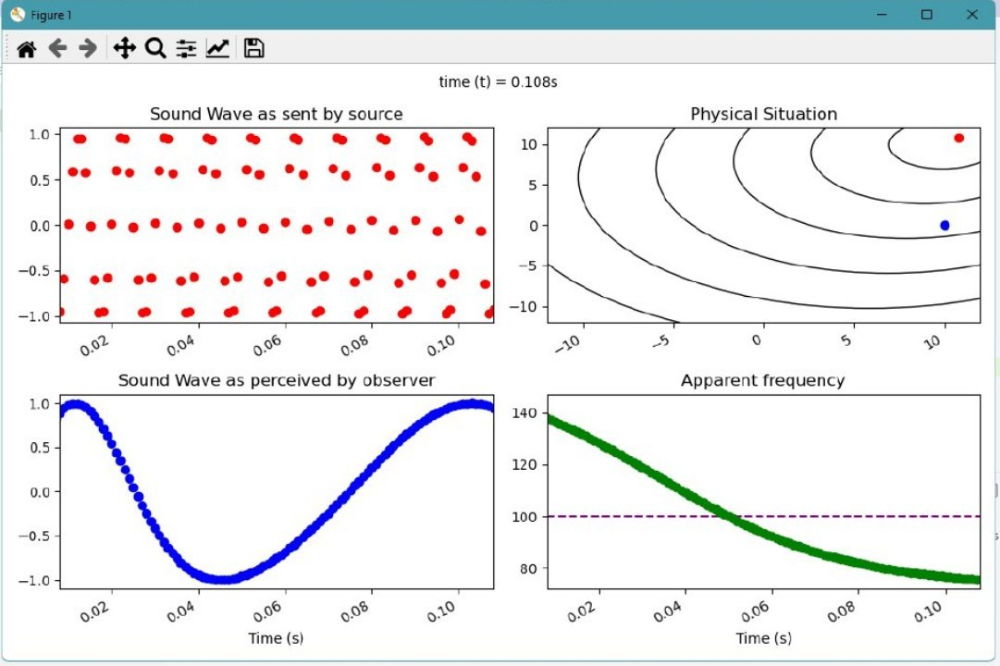

# doppler-effect
Virtual simulation of Doppler Effect in Sound

---
# Introduction

Doppler effect or Doppler shift is a phenomenon that is observed whenever the source of waves is moving with respect to an observer.

This phenomenon can be observed in both Sound and Light but in case of Light, [*Special Theory of Relativity*](https://en.wikipedia.org/wiki/Special_relativity) have to be considered and hence the cause of the effect is different for both cases.

---

## Doppler Effect in Sound

As the source of sound waves approaches a listener, the sound waves get closer together, increasing their frequency and the pitch of the sound.

The mathematical equation governing Doppler Effect in sound is given as :


where,  = Speed of sound *(typically 330 m/s)*

 = Component of velocity of observer along line joining source and observer

 = Component of velocity of source along line joining source and observer

**Note :** Components must have proper sign () as per reference to direction of sound traversing

### Simulation

The program takes in the following values and renders a simulation of observer and source along with necessary information plotted for visual reference.
```python
v_sound = 330.0  # Speed of sound
x_source, y_source = (0, 0)  # Source Coordinates
x_observer, y_observer = (10, 0)  # Observer Coordinates
vx_source, vy_source = (100, 100)  # Source Velocity
vx_observer, vy_observer = (0, 0)  # Observer Velocity
frequency = 100  # Frequency of Sound Wave (integer)
```

The speed of simulation can be increase by [changing the parameter `program_speed`](https://github.com/dvishal485/doppler-effect/blob/b85d1dfb5a64b3a1611dc79460248a9f35407e46/main.py#L16) but is not recommended beyond 2 as it may conflict with wave productions and animations.

```
program_speed = 2
```



#### Limitation
The graph may have abrupt breaks due to physical limitations.

# License & Copyright

  - This Project is [Apache-2.0](./LICENSE) Licensed
  - Copyright 2021 [Vishal Das](https://github.com/dvishal485)
  